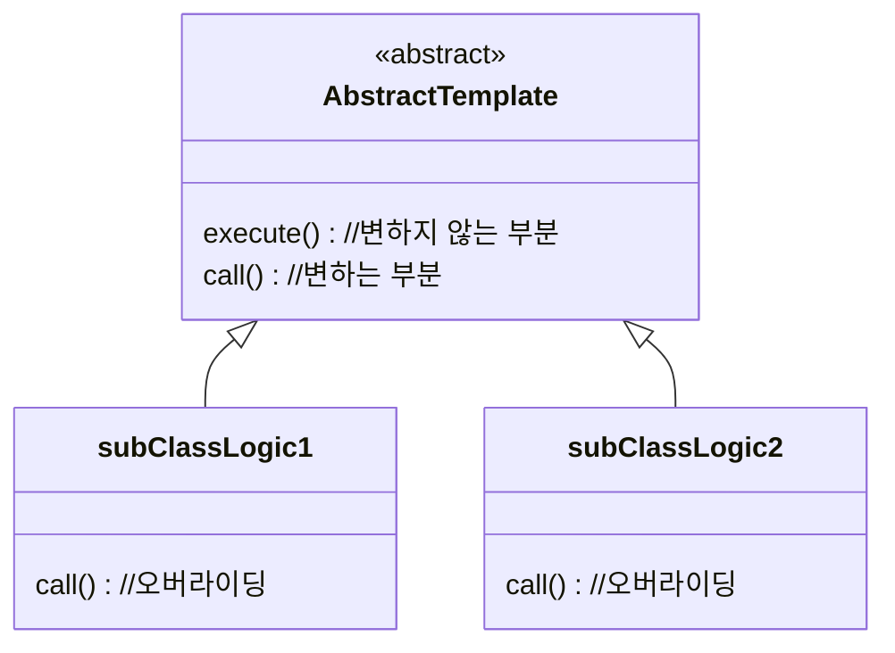
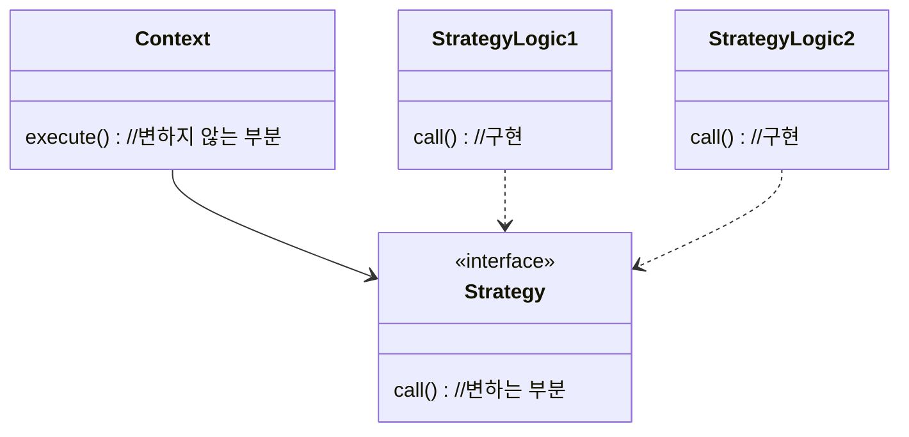
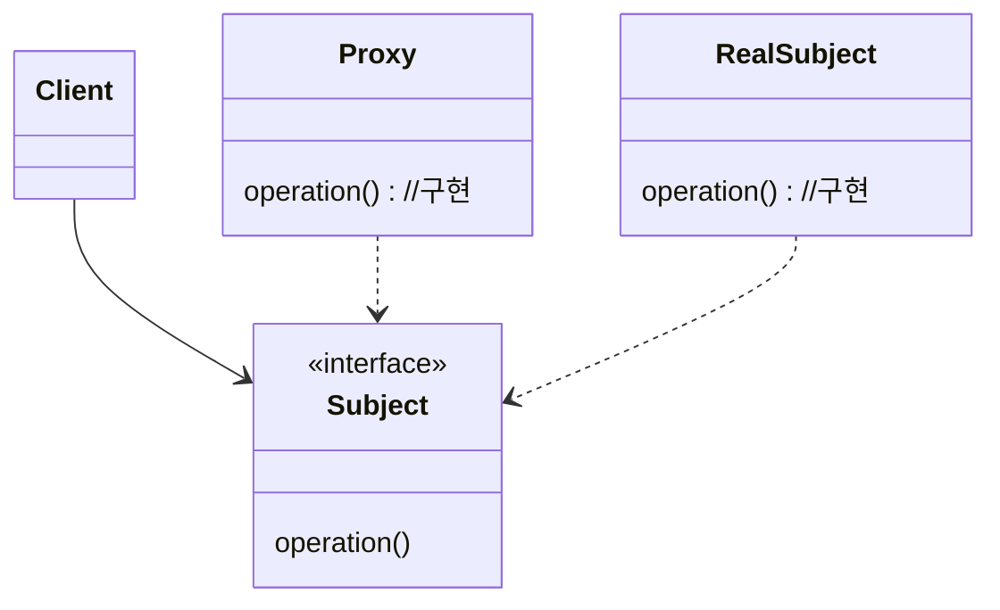

# 스프링 핵심 원리 - 고급편

## Navigation
- [로그 추적기](#-로그-추적기)
  - [템플릿 콜백 패턴](#로그추적기-v5-템플릿-콜백-패턴-전략패턴위임--파라미터-방식)
- [프록시](#-프록시패턴과-데코레이터-패턴)
  - [빈후처리기]()

## 프로젝트 생성 및 세팅
- 'https://start.spring.io/' 에서 프로젝트 생성
    - SpringBoot `2.7.13`
    - Gradle Groovy `7.6.1`
    - java `17`
    - Dependencies
        - WEB : `Spring Web`
        - DEVELOPER TOOLS : `Lombok`
- IDE : IntelliJ

## 빌드하기
```bash
# 빌드
$ .\gradlew build

# 실행
$ cd .\build\libs 
$ java -jar .\advanced-0.0.1-SNAPSHOT.jar
```
---

### 💜 로그 추적기
#### 요구사항 분석
- 모든 Public 메서드의 호출과 응답 정보를 로그로 출력
- 애플리케이션의 흐름을 변경하면 안됨.
  - 비즈니스 로직의 동작에 영향을 주면 안됨
- 메서드 호출에 걸린 시간
- 정상 흐름과 예외 흐름 구분 (예외 발생 시 예외 정보 남아야 함)
- 메서드 호출의 깊이 표현
- HTTP 요청 구분
  - HTTP 요청 단위로 특정 ID를 남겨서 어떤 HTTP 요청에서 시작된 것인지 명확하게 구분
  - 트랜잭션 ID (고객 요청이 시작해서 끝날 때 까지) (<=DB의 트랜잭션 아님)
```html
로그 시작: [796bccd9] OrderController.request()
로그 정상 종료: [796bccd9] OrderController.request() time=1016ms
로그 예외 종료:  [796bccd9] |   |<X-OrderRepository.save() time=0ms ex=java.lang.IllegalStateException: 예외 발생!
```
#### 로그추적기 v1. 프로토 타입 개발
- TraceId : 트랜잭션 ID, 깊이를 표현하는 클래스
- TraceStatus : 로그를 시작하면 시작과 끝이 있어야함
- 현재는 요청이 오면 TraceId 생성
- controller 에서 로그 찍고 service 로 넘어감
- service 에서 TraceId 유지하지않고 새로 생성, level==0으로 로그 찍고 Repository 로 넘어감
- repository 에서 TraceId 유지하지않고 새로 생성, level==0으로 로그 찍고 종료(종료할때는 statusId 유지)
- 문제
  - controller, service, repository 각각에서는 트랜잭션 ID 동기화 되어있음
  - HTTP 요청 단위로 트랜잭션 ID, 메서드 호출 깊이(level) 동기화 안됨

#### 로그추적기 v2. 파라미터로 동기화
- controller에서 트랜잭션 ID 생성
- controller -> service -> repository 에 트랜잭션 ID 넘겨줌
- service, repository에서는 beginSync() 메서드 호출
- 문제
  - traceId 동기화를 위하여 관련 메서드, 인터페이스가 있다면 인터페이스까지 모두 수정해야함.
  - begin, beginSync 각각 호출해줘야함
  - 만약 컨트롤러를 통해서 서비스를 호출하는 것이 아니라면 파라미터로 넘길 traceId가 없음.

#### 로그추적기 v3. 필드 동기화
- 필드를 통해서 traceId 동기화
- `FieldLogTrace` Config 파일에 `@Bean`으로 등록 : 싱글톤 
- 동시성 문제 발생
  - 1초 내에 2번이상 호출 시 트랜젝션ID 구분이 안됨
  - 쓰레드 번호는 다름 [nio-8080-exec-7] / [nio-8080-exec-8]
  - 스프링 빈처럼 `싱글톤 객체의 필드를 변경`하여 사용할 때 동시성문제 조심해야 함.
  - 참고 : 인스턴스 필드(주로 싱글톤) 또는 static 같은 공용 필드에 접근할 때 발생(읽기만 할때는 발생 안함)

#### 로그추적기 v3 개선. 쓰레드 로컬 `ThreadLocal<T>`
- 해당 쓰레드만 접근 할 수 있는 특별한 저장소
- set(), get(), remove() 메서드 사용
- 사용자A의 요청이 들어오면 WAS는 쓰레드풀에서 쓰레드를 하나 조회해서 할당
- `Thread-A`는 사용자A의 데이터를 쓰레드 로컬 전용보관소에 저장
- 사용자A의 응답이 끝나면 WAS는 `Thread-A`를 쓰레드풀에 반환
- 이 때 `Thread-A`의 쓰레드 로컬 전용보관소에 사용자A의 데이터가 살아있음
- 사용자B가 `Thread-A`를 할당받았을때 사용자A의 정보를 조회하게 됨.
- 사용자A의 요청이 끝나면 (쓰레드 로컬 완료 후) 저장된 값을 반드시 제거해주어야 함
- 문제 : 핵심 기능 코드에 try, catch 등 부가 기능(로그 관련) 코드가 붙어있어 복잡함 

#### 로그추적기 v4. 템플릿 메서드 패턴 (다형성)
- 핵심기능과 부가기능(핵심기능 보조)으로 나눔
- 변하는 것(핵심기능)과 변하지 않는것(부가기능)을 분리해서 모듈화
- 부모 클래스(추상클래스)에 변하지 않는 부분을 정의해두고
- 변하는 부분을 자식클래스(또는 익명내부클래스)에서 오버라이딩
- 단일책임의 원칙 지킬 수 있음
- 단점 (상속의 단점)
  - 자식클래스가 부모클래스를 상속받고 있으나 (강하게 의존) 부모클래스 메서드 사용 안함
  - 부모클래스가 변경이 되면 자식클래스도 변경이 되어야 함. (영향을 받음)

#### 로그추적기 v5. 템플릿 콜백 패턴 (전략패턴(위임) : 파라미터 방식)
- 변하지 않는 부분을 `Context`라는 곳에 두고,
- 변하는 부분을 `Strategy`라는 인터페이스를 만들고 구현
  - 인터페이스에 메서드가 한개만 있으면 람다로 더 간결하게 사용할 수 있음 
- 스프링에서 사용하는 의존관계주입과 같은 패턴
- 필드방식(선조립후실행) : context와 strategy 조립 후에는 변경이 번거로움
- 파라미터방식 : context의 메서드 실행할 때 strategy를 파라미터로 전달 => `템플릿 콜백 패턴`


#### 여기까지 로직 : v5 
- `ThreadLocalLogTrace` : `LogTrace` interface의 begin, end, exception 메서드 구현체
  - `ThreadLocal` 사용하여 traceId를 쓰레드로컬 전용보관소에 저장 
  - `@Configuration`에서 `@Bean`으로 등록해놓고 사용
- `TraceCallback`: 변하는 로직 인터페이스
- `TraceTemplate`에 변하지 않는 로직을 두고, 변하는 로직은 인터페이스 호출
  - `TraceTemplate` 생성 시 `LogTrace` 주입
  - `TraceTemplate`의 execute() 메서드 호출 시 `TraceCallback`인터페이스의 메서드 람다로 구현

### 💜 프록시패턴과 데코레이터 패턴
#### 프록시, 프록시 패턴, 데코레이터 패턴

- 클라이언트가 서버에 직접 요청 하는 것이 아니라
- 프록시를 통해 간접적으로 서버에 요청 함.
- 객체에서 프록시가 되려면, 서버와 프록시는 같은 인터페이스를 사용해야 함.
- 프록시의 주요 기능
  - `프록시패턴`: 접근제어 목적
    - 권한에 따른 접근 차단
    - 캐싱
    - 지연로딩
  - `데코레이터 패턴`: 부가 기능 추가 목적
    - 원래 서버가 제공하는 기능에 더해 부가 기능 수행 

#### 참고
- Application 하위 스캔대상 지정하기
```java
@Import({AppV1Config.class, AppV2Config.class})
@SpringBootApplication(scanBasePackages = "study.advanced.proxy")
public class AdvancedApplication {
  ...
}
```

#### 요구사항 분석
- **원본코드를 전혀 수정하지 않고** 로그 추적기 적용
- 특정 메서드는 로그를 출력하지 않는 기능

#### v1. 인터페이스와 구현 클래스 - 스프링 빈으로 수동 등록
- 클라이언트는 `controller 프록시`를 호출
- `controller 프록시`는 `controller 구현체` 호출
- `controller 구현체`는 `service 프록시` 호출
- `service 프록시`는 `service 구현체` 호출
- `service 구현체`는 `repository 프록시` 호출
- `repository 프록시`는 `repository 구현체` 호출
- 프록시 객체는 스프링 컨테이너가 관리하고 힙 메모리에도 올라감
- 실제 객체는 힙 메모리에는 올라가지만 스프링 컨테이너가 관리하지 않음

#### v2. 인터페이스가 없는 구체 클래스 - 스프링 빈으로 수동 등록
- 인터페이스를 구현하는 것이 아닌 클래스를 상속받아서 사용함
- 단점: 상속에 따른 제약사항
  - 부모클래스의 생성자 호출해야함
  - 클래스에 `final` 키워드 붙어있으면 상속 불가
  - 메서드에 `final` 키워드 붙어있으면 오버라이딩 불가

##### 🎈참고: 리플렉션
- 클래스나 메서드의 메타정보를 동적으로 획득하고, 코드도 동적으로 호출
- `Class.forName(class명)` 로 클래스 정보 획득
- `getMethod(method명)`로 클래스의 메서드 정보 획득
- `invoke(실제method가 있는 클래스)`로 메서드 실행
- `getMethod()`의 메서드 정보가 실제 호출할 클래스와 다르면 예외 발생
- 리플렉션 기술은 런타임에 동작하기 때문에 컴파일 시점에 오류를 잡을 수 없음

##### 🎈참고: JDK Dynamic Proxy
- JDK 동적 프록시는 인터페이스 필수
- `InvocationHandler`를 구현한 `TimeInvocationHandler`에서 공통으로 사용할 로직 구현
- `Proxy.newProxyInstance()` 메서드를 이용하여 자바가 프록시 생성
  - `AInterface.class.getClassLoader()` 어느 클래스로더에 할 지
  - `new Class[]{AInterface.class}` 어떤 인터페이스 기반으로 프록시를 만들건지
  - `new TimeInvocationHandler(target)` 사용할 로직은 뭔지 인자로 넘겨줌

##### 🎈참고: CGLIB
- `MethodInterceptor`를 구현한 `TimeMethodInterceptor`에서 공통으로 사용할 로직 구현
- `methodProxy.invoke()`가 성능면에서 더 우수 (매뉴얼)
- `Enhancer` 를 이용하여 프록시 생성
  - `setSuperclass()` 어떤 구체클래스를 상속 받을지
  - `setCallback()` 실행로직 할당
  - `create()` 프록시 생성

##### 🎈참고: 프록시 팩토리
- 스프링이 제공하는 프록시 팩토리
- 인터페이스가 있으면 JDK 동적프록시, 구체 클래스만 있으면 CGLIB 적용
- `aopalliance` 패키지의 `MethodInterceptor` 상속받아서 `Advice` 구현
- `invocation.proceed()`로 실행
  - target은 proxyFactory 생성시점에 넣어줌 
- `ProxyFactory`의 `getProxy()`를 통해 프록시 생성
- `proxyFactory.setProxyTargetClass(true)`를 통해 인터페이스 여부 상관없이 CGLIB 적용 할 수 있음

##### 🎈참고: 어드바이저
- 포인트컷: 어디에 부가기능을 적용할 지 안할지 판단 (필터링 로직)
- 어드바이스: 프록시가 호출하는 부가기능 (프록시 로직)
- 어드바이저: 하나의 포인트컷과 하나의 어드바이스를 가지고 있음
  - `DefaultPointcutAdvisor(포인트컷, 어드바이스)` 
- 프록시팩토리가 프록시 호출 -> 어드바이저 호출 -> 포인트컷과 어드바이스 호출
- 하나의 프록시는 여러개의 어드바이저를 가질 수 있음
  - `addAdvisor(어드바이저)` 등록 순서에 따라 어드바이저 호출

#### v3. 동적프록시: 컴포넌트 스캔으로 스프링빈 자동 등록
- `BeanPostProcessor` 구현한 후 `@Bean`으로 등록해서 사용
- 컴포넌트 스캔 대상이 되는 빈들도 자동으로 적용 가능
- 스프링부트가 생성하는 빈들이 후처리기를 통과함
  - 적용할 패키지 특정, 어드바이저 지정 후에 사용 할 것
  - 포인트컷을 사용하여 더 효과적으로 필터링 가능
  - v1 : 인터페이스가 있으므로 jdk 동적 프록시로 생성
  - v2, v3 : 구체클래스만 있으므로 cglib 프록시 생성

##### 🎈참고: 빈 후처리기 (Bean PostProcessor)
- 스프링이 빈 저장소에 등록할 목적으로 생성한 객체를 빈 저장소에 등록하기 직전에
- 객체의 조작 또는 완전히 다른 객체로 바꿔치기 할 수 있음
- 빈 객체를 프록시로 교체하는 것이 가능

##### 🎈참고: 자동 프록시 생성기
- 스프링이 제공하는 빈 후처리기 `AutoProxyCreator`
```java
implementation 'org.springframework.boot:spring-boot-starter-aop'
```
- 자동프록시 생성기의 작동과정
  - 스프링빈 대상이 되는 객체 생성
  - 생성된 객체를 빈 저장소에 등록하기 전에 `빈 후처리기`에 전달
  - 스프링컨테이너에서 모든 어드바이저 빈 조회
  - 어드바이저에 포함되어 있는 `포인트컷`을 사용해서 프록시 적용 대상여부 판단
  - 프록시 적용 대상이면 프록시 생성 및 반환, 적용 대상이 아니면 원본 객체 반환
    - 프록시 생성할 때 `포인트컷` 만족하는 어드바이저 모두 포함해서 생성 함. 
  - 스프링빈으로 반환된 프록시 또는 원본 객체 등록함
```java
@Aspect
public class LogTraceAspect {
  ...
    //포인트컷
    @Around("execution(* study.advanced.proxy..*(..))") 
    public Object execute(ProceedingJoinPoint joinPoint) throws Throwable {
        //어드바이스
    }
}
```