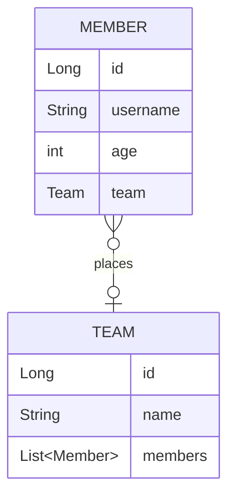

# 실전! 스프링 데이터 JPA

## 프로젝트 생성 및 세팅
- 'https://start.spring.io/' 에서 프로젝트 생성
    - SpringBoot `2.7.13`
    - Gradle Groovy `7.6.1`
    - java `17`
    - Dependencies
        - WEB : `Spring Web`
        - SQL : `Spring Data JPA`  `H2 Database`
        - DEVELOPER TOOLS : `Lombok`
        - External Library : `com.github.gavlyukovskiy:p6spy-spring-boot-starter:1.5.7`
- IDE : IntelliJ
- DB : H2 `jdbc:h2:tcp://localhost/~/data-jpa`

## 빌드하기
```bash
# 빌드
$ .\gradlew build

# 실행
$ cd .\build\libs 
$ java -jar .\data-jpa-0.0.1-SNAPSHOT.jar
```
---

### 💜 도메인 설계

- JPA 표준스펙에 entity의 default 생성자 필요 (protected)
  - `@NoArgsConstructor(access = AccessLevel.PROTECTED)`
- 연관관계필드는 toString 안하는게 좋음
  - `@ToString(of = {"id", "username", "age"})`
- x to one 은 반드시 지연로딩 걸어주기 
  - `@ManyToOne(fetch = FetchType.LAZY)`
> @ManyToOne  
> `member 및 team 조회 쿼리 생성`  
> member = Member(id=1, username=member1, age=10)  
> -> member.team = Team(id=1, name=teamA)

> @ManyToOne(fetch = FetchType.LAZY)  
> `member 조회 쿼리 생성`  
> member = Member(id=1, username=member1, age=10)  
> `team 조회 쿼리 생성`  
> -> member.team = Team(id=1, name=teamA)

- 주로 FK가 없는 쪽에 mappedBy 걸어줌
  - `@OneToMany(mappedBy = "team")` 
- 연관관계 메서드 만들어주기
```java
public void changeTeam(Team team){
    this.team = team;
    team.getMembers().add(this);
}
```

### 💜 Repository 설계

