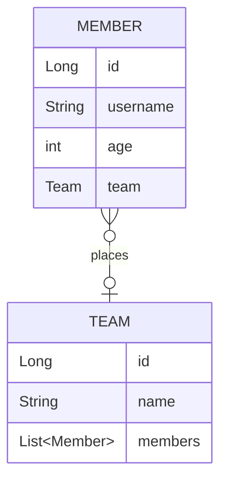

# 실전! 스프링 데이터 JPA

## 프로젝트 생성 및 세팅
- 'https://start.spring.io/' 에서 프로젝트 생성
    - SpringBoot `2.7.13`
    - Gradle Groovy `7.6.1`
    - java `17`
    - Dependencies
        - WEB : `Spring Web`
        - SQL : `Spring Data JPA`  `H2 Database`
        - DEVELOPER TOOLS : `Lombok`
        - External Library : `com.github.gavlyukovskiy:p6spy-spring-boot-starter:1.5.7`
- IDE : IntelliJ
- DB : H2 `jdbc:h2:tcp://localhost/~/data-jpa`

## 빌드하기
```bash
# 빌드
$ .\gradlew build

# 실행
$ cd .\build\libs 
$ java -jar .\data-jpa-0.0.1-SNAPSHOT.jar
```
---

### 💜 도메인 설계

- JPA 표준스펙에 entity의 default 생성자 필요 (protected)
  - `@NoArgsConstructor(access = AccessLevel.PROTECTED)`
- 연관관계필드는 toString 안하는게 좋음
  - `@ToString(of = {"id", "username", "age"})`
- x to one 은 반드시 지연로딩 걸어주기 
  - `@ManyToOne(fetch = FetchType.LAZY)`
> @ManyToOne  
> `member 및 team 조회 쿼리 생성`  
> member = Member(id=1, username=member1, age=10)  
> -> member.team = Team(id=1, name=teamA)

> @ManyToOne(fetch = FetchType.LAZY)  
> `member 조회 쿼리 생성`  
> member = Member(id=1, username=member1, age=10)  
> `team 조회 쿼리 생성`  
> -> member.team = Team(id=1, name=teamA)

- 주로 FK가 없는 쪽에 mappedBy 걸어줌
  - `@OneToMany(mappedBy = "team")` 
- 연관관계 메서드 만들어주기
```java
public void changeTeam(Team team){
    this.team = team;
    team.getMembers().add(this);
}
```

### 💜 쿼리 메서드
- [쿼리 메서드 필터 조건](https://docs.spring.io/spring-data/jpa/docs/current/reference/html/#jpa.query-methods.query-creation)
  - 조회 : find...By() => 괄호안에 where 절 조건
    - Distinct : findMemberDistinctBy()
    - Limit : findTop3()
  - 파라미터가 많아지면 메서드명이 너무 길어짐
- JPA NamedQuery
  - entity 에 NamedQuery 선언
  - NamedQuery 를 먼저 찾고 없으면 메서드 이름으로 쿼리 생성
  - application loading 시점에 오류(오타 등) 잡을 수 있음
  - 실무에서는 잘 안쓰는 기능
- Repository 에 Query 정의
  - application loading 시점에 오류(오타 등) 잡을 수 있음
```java
@Query("select m from Member m where m.username = :username and m.age = :age")
List<Member> findUser(@Param("username") String username, @Param("age") int age);
```
  - DTO 로 조회하기
```java
@Query("select new study.datajpa.dto.MemberDto(m.id, m.username, t.name) from Member m join m.team t")
List<MemberDto> findMemberDto();
```
- 파라미터 바인딩
  - 파라미터로 collection 받을 경우 in 절 지원
```java
@Query("select m from Member m where m.username in :names")
List<Member> findByNames(@Param("names") Collection<String> names);
```
- 페이징 기능
```java
//MemberRepository
Page<Member> findByAge(int age, Pageable pageable);

//Test
//0page에서 3개 가져오기
PageRequest pageRequest = PageRequest.of(0, 3, Sort.by(Sort.Direction.DESC, "username"));
Page<Member> page = memberRepository.findByAge(age, pageRequest);

//관련메서드
page.getNumber() //현재 페이지의 번호
page.getTotalPages()
page.isFirst() //첫번쨰 페이지냐?
page.hasNext() //다음페이지가 있냐?
        ...
```
- 벌크성 수정쿼리
  - 주의 : 벌크 연산 이후에는 영속성컨텍스트 다 날려버려야됨!
    - 벌크 연산을 날리면 JPA 는 변경을 감지하지 못하고 있어서
    - DB와 영속성 컨텍스트 내의 엔티티가 다른 값을 가짐
```java
@Modifying(clearAutomatically = true)
@Query("update Member m set m.age = m.age + 1 where m.age >= :age")
int bulkAgePlus(@Param("age") int age);
```

- 엔티티 그래프(EntityGraph)
  - xToOne 지연로딩일때 내부적으로 `fetch join` 실행 됨
  - 간단한 경우에 사용
```java
@Override
@EntityGraph(attributePaths = {"team"})
List<Member> findAll();
```

### 💜 사용자정의 리포지토리 구현
- 별도의 interface 작성 및 구현클래스 작성 후
  - 구현체클래스의 이름 규칙 : `MemberRepository` + `Impl` 
  - 최신 ver. 구현체클래스의 이름 규칙 : `커스텀Interface명` + `Impl`
- JpaRepository 상속한 Repository 에 추가해주기
```java
public interface MemberRepository extends JpaRepository<Member, Long>, MemberRepositoryCustom {
  ...
}
```

### 💜 Auditing
- 엔티티 생성, 변경 할 때 변경한 사람과 시간 추적하기
```java
//Auditing Class 만들고
@EntityListeners(AuditingEntityListener.class)
@MappedSuperclass
@Getter
public class BaseEntity {

  //생성일, 수정일
  @CreatedDate
  @Column(updatable = false)
  private LocalDateTime createdDate;

  @LastModifiedDate
  private LocalDateTime lastModifiedDate;

  //생성자, 수정자
  @CreatedBy
  @Column(updatable = false)
  private String createBy;

  @LastModifiedBy
  private String lastModifiedBy;

}

//상속받아서 사용
public class Member extends BaseEntity {
  ...
}

//스프링부트 application에 반드시 annotation 추가
@EnableJpaAuditing
@SpringBootApplication
public class DataJpaApplication {
  ...
}
```

### 💜 페이징과 정렬
- 파라미터로 받을때
  - http://localhost:8080/members : 디폴트 페이지 당 size 20개
  - http://localhost:8080/members `?page=2` : 페이지 당 size 20개
  - http://localhost:8080/members `?page=1&size=5` : 페이지 당 size 5개
  - http://localhost:8080/members `?page=1&size=5&sort=id,desc` 정렬조건 추가
- 별도 page 파라미터 없이 paging 개수 정하고 싶을 떄
  - application.yml 에서 수정
  - 각 컨트롤러에서 `@PageableDefault` 추가
```java
public Page<Member> list(@PageableDefault(size = 5, sort = "username") Pageable pageable) {
        ...
}
```
- ⭐entity 를 그대로 내보내지 말고 반드시 dto 로 변환해서 내보내자!⭐
```java
@GetMapping("/members")
public Page<MemberDto> list(@PageableDefault(size = 5) Pageable pageable) {
    return memberRepository.findAll(pageable).map(MemberDto::new);
}
```

### 💜 새로운 엔티티를 구별
- Entity 를 처음 만들때 @Id, @GeneratedValue 에 의해 id 값이 없음
  - 이때 식별자를 Primitive type 인 long 이면 0으로 판단
  - Reference Type 인 Long 으로 쓰면 null 로 판단
- null 이면 `persist`
- null 이 아니면 `merge`
- **`@GeneratedValue` 안쓰면 jpa 가 새로운 객체로 인식하지않으므로 persist X**
  - `Persistable` 인터페이스를 구현해서 새로운 객체 여부 로직 만들기
  - 보통 `@CreatedDate` 활용하여 `CreatedDate==null`이면 새로운 객체로 인식

### 💜 Projections
- Entity 대신 DTO 편리하게 조회할 때 사용
- 인터페이스 기반 Closed Projections
```mysql
select
    member0_.username as col_0_0_ 
from
    member member0_ 
where
    member0_.username=?
```
- 클래스 기반 Projection
- 동적 Projections
```java
<T> List<T> findProjectionsByUsername(String username, Class<T> type);
```
  - 중첩구조 처리
    - 프로젝션 대상이 ROOT 가 아니면 LEFT OUTER JOIN 처리 => 최적화가 안됨