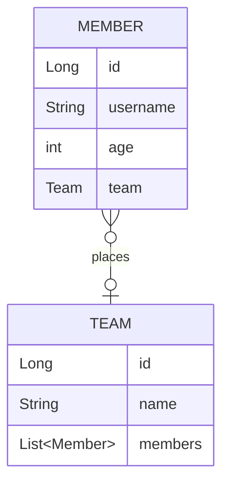

# 실전! 스프링 데이터 JPA

## 프로젝트 생성 및 세팅
- 'https://start.spring.io/' 에서 프로젝트 생성
    - SpringBoot `2.7.13`
    - Gradle Groovy `7.6.1`
    - java `17`
    - Dependencies
        - WEB : `Spring Web`
        - SQL : `Spring Data JPA`  `H2 Database`
        - DEVELOPER TOOLS : `Lombok`
        - External Library : `com.github.gavlyukovskiy:p6spy-spring-boot-starter:1.5.7`
- IDE : IntelliJ
- DB : H2 `jdbc:h2:tcp://localhost/~/querydsl`

## Querydsl 설정
```java
//build.gradle
buildscript {
    ext {
        queryDslVersion = "5.0.0"   
    }
}

plugins {
    ...
    id "com.ewerk.gradle.plugins.querydsl" version "1.0.10"
    ...
}
dependencies{
    ...
    implementation"com.querydsl:querydsl-jpa:${queryDslVersion}"
    annotationProcessor"com.querydsl:querydsl-apt:${queryDslVersion}"
    ...
}

def querydslDir = "$buildDir/generated/querydsl"
querydsl {
    jpa = true
    querydslSourcesDir = querydslDir
}
sourceSets {
    main.java.srcDir querydslDir
}
configurations {
    querydsl.extendsFrom compileClasspath
}
compileQuerydsl{
    options.annotationProcessorPath=configurations.querydsl
}
```
- Gradle IntelliJ 사용법
> Gradle -> Tasks -> build -> clean  
> Gradle -> Tasks -> other -> compileQuerydsl
- Q타입 생성 확인
> build -> generated -> querydsl

## 빌드하기
```bash
# 빌드
$ .\gradlew build

# 실행
$ cd .\build\libs 
$ java -jar .\querydsl-0.0.1-SNAPSHOT.jar
```
---

### 💜 도메인 설계
> Gradle -> Tasks -> other -> compileQuerydsl


### 💜 기본문법
- 검색조건 쿼리
```java
member.username.eq("member1") // username = 'member1' 
member.username.ne("member1") //username != 'member1' 
member.username.eq("member1").not() // username != 'member1'
member.username.isNotNull() //이름이 is not null
member.age.in(10, 20) // age in (10,20) 
member.age.notIn(10, 20) // age not in (10, 20) 
member.age.between(10,30) //between 10, 30
member.age.goe(30) // age >= 30 
member.age.gt(30) // age > 30 
member.age.loe(30) // age <= 30 
member.age.lt(30) // age < 30
member.username.like("member%") //like 검색 
member.username.contains("member") // like ‘%member%’ 검색 
member.username.startsWith("member") //like ‘member%’ 검색 
```
- 결과조회
```java
//list
.fetch();

//단건조회
//결과가 둘 이상이면 NonUniqueResultException
.fetchOne();

//단건조회(첫번째 값 가져옴)
.fetchFirst();
        
//count
//fetchResults() , fetchCount() Deprecated
Long count = queryFactory
                .select(member.count())
                .from(member)
                .fetchOne();
```
- 정렬
```java
.orderBy(member.age.desc(), member.username.asc().nullsLast())
```
- 집합, groupBy
> 반환타입 : Tuple
```java
//집합함수
.select(
    member.count(),
    member.age.sum(),
    member.age.avg(),
    member.age.max(),
    member.age.min()
)

//groupBy
.groupBy(team.name)
```
- join(조인 대상, 별칭으로 사용할 Q타입)
  - inner join : join 되는 대상(teamA)의 member 가져옴
  - left join : left 가 member 이므로 member 정보는 다 가져옴
  - fetch join 
```java
//inner join
.join(member.team, team)
.on(team.name.eq("teamA"))
또는
.where(team.name.eq("teamA"))

//결과
//tuple = [Member(id=1, username=member1, age=10), Team(id=1, name=teamA)]
//tuple = [Member(id=2, username=member2, age=20), Team(id=1, name=teamA)]

//left join
.leftJoin(member.team, team) 
.on(team.name.eq("teamA"))

//결과
//tuple = [Member(id=1, username=member1, age=10), Team(id=1, name=teamA)]
//tuple = [Member(id=2, username=member2, age=20), Team(id=1, name=teamA)]
//tuple = [Member(id=3, username=member3, age=30), null]
//tuple = [Member(id=4, username=member4, age=40), null]
```
- 서브 쿼리
    - alias 주의 (QType 새로 하나 만들어주기)
    - `JPAExpressions` 사용
    - select, where 절에서는 사용가능하나
    - from 절에서는 사용이 불가