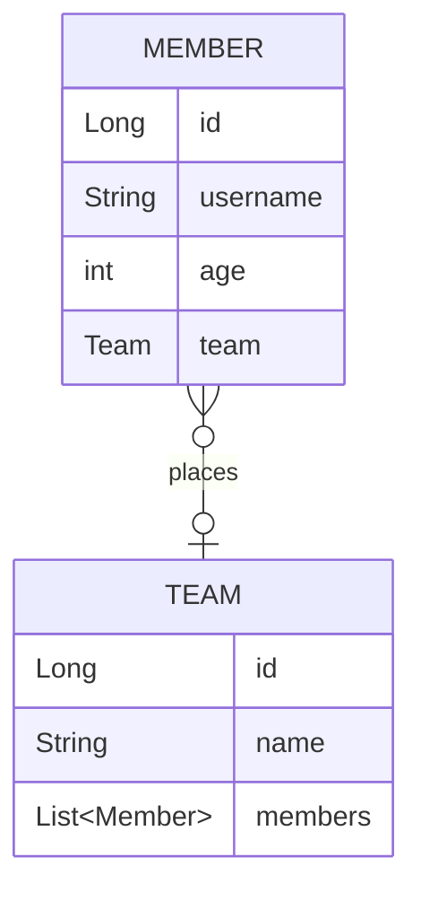

# 실전! 스프링 데이터 JPA

## 프로젝트 생성 및 세팅
- 'https://start.spring.io/' 에서 프로젝트 생성
    - SpringBoot `2.7.13`
    - Gradle Groovy `7.6.1`
    - java `17`
    - Dependencies
        - WEB : `Spring Web`
        - SQL : `Spring Data JPA`  `H2 Database`
        - DEVELOPER TOOLS : `Lombok`
        - External Library : `com.github.gavlyukovskiy:p6spy-spring-boot-starter:1.5.7`
- IDE : IntelliJ
- DB : H2 `jdbc:h2:tcp://localhost/~/querydsl`

## Querydsl 설정
```java
//build.gradle
buildscript {
    ext {
        queryDslVersion = "5.0.0"   
    }
}

plugins {
    ...
    id "com.ewerk.gradle.plugins.querydsl" version "1.0.10"
    ...
}
dependencies{
    ...
    implementation"com.querydsl:querydsl-jpa:${queryDslVersion}"
    annotationProcessor"com.querydsl:querydsl-apt:${queryDslVersion}"
    ...
}

def querydslDir = "$buildDir/generated/querydsl"
querydsl {
    jpa = true
    querydslSourcesDir = querydslDir
}
sourceSets {
    main.java.srcDir querydslDir
}
configurations {
    querydsl.extendsFrom compileClasspath
}
compileQuerydsl{
    options.annotationProcessorPath=configurations.querydsl
}
```
- Gradle IntelliJ 사용법
> Gradle -> Tasks -> build -> clean  
> Gradle -> Tasks -> other -> compileQuerydsl
- Q타입 생성 확인
> build -> generated -> querydsl

## 빌드하기
```bash
# 빌드
$ .\gradlew build

# 실행
$ cd .\build\libs 
$ java -jar .\querydsl-0.0.1-SNAPSHOT.jar
```
---

### 💜 도메인 설계
> Gradle -> Tasks -> other -> compileQuerydsl


### 💜 기본문법
- 검색조건 쿼리
```java
member.username.eq("member1") // username = 'member1' 
member.username.ne("member1") //username != 'member1' 
member.username.eq("member1").not() // username != 'member1'
member.username.isNotNull() //이름이 is not null
member.age.in(10, 20) // age in (10,20) 
member.age.notIn(10, 20) // age not in (10, 20) 
member.age.between(10,30) //between 10, 30
member.age.goe(30) // age >= 30 
member.age.gt(30) // age > 30 
member.age.loe(30) // age <= 30 
member.age.lt(30) // age < 30
member.username.like("member%") //like 검색 
member.username.contains("member") // like ‘%member%’ 검색 
member.username.startsWith("member") //like ‘member%’ 검색 
```
- 결과조회
```java
//list
.fetch();

//단건조회
//결과가 둘 이상이면 NonUniqueResultException
.fetchOne();

//단건조회(첫번째 값 가져옴)
.fetchFirst();
        
//count
//fetchResults() , fetchCount() Deprecated
Long count = queryFactory
                .select(member.count())
                .from(member)
                .fetchOne();
```
- 정렬
```java
.orderBy(member.age.desc(), member.username.asc().nullsLast())
```
- 집합, groupBy
> 반환타입 : Tuple
```java
//집합함수
.select(
    member.count(),
    member.age.sum(),
    member.age.avg(),
    member.age.max(),
    member.age.min()
)

//groupBy
.groupBy(team.name)
```
- join(조인 대상, 별칭으로 사용할 Q타입)
  - inner join : join 되는 대상(teamA)의 member 가져옴
  - left join : left 가 member 이므로 member 정보는 다 가져옴
  - fetch join 
```java
//inner join
.join(member.team, team)
.on(team.name.eq("teamA"))
또는
.where(team.name.eq("teamA"))

//결과
//tuple = [Member(id=1, username=member1, age=10), Team(id=1, name=teamA)]
//tuple = [Member(id=2, username=member2, age=20), Team(id=1, name=teamA)]

//left join
.leftJoin(member.team, team) 
.on(team.name.eq("teamA"))

//결과
//tuple = [Member(id=1, username=member1, age=10), Team(id=1, name=teamA)]
//tuple = [Member(id=2, username=member2, age=20), Team(id=1, name=teamA)]
//tuple = [Member(id=3, username=member3, age=30), null]
//tuple = [Member(id=4, username=member4, age=40), null]
```
- 서브 쿼리
    - alias 주의 (QType 새로 하나 만들어주기)
    - `JPAExpressions` 사용
    - select, where 절에서는 사용가능하나
    - from 절에서는 사용이 불가
- Case 문
  - 왠만하면 DB는 raw 데이터 필터링, 그룹핑만 하고
  - 어플리케이션, 프리젠테이션 레이어에서 해결하기
```java
.when(10).then("열살")
``` 

### 💜 프로젝션 - DTO 조회
- 프로퍼티 접근(Setter)
- 필드 직접 접근
- 생성자 사용
  - Projections.constructor : 런타임오류
  - QueryProjection : 컴파일오류
    - 생성자에 QueryProjection 붙여주고
    - querydsl compile 실행
    - Dto 가 Querydsl 에 의존성을 가짐 
```java
    //생성자 방식
//필드 이름이 달라도 타입만 맞으면 적용 됨
public void findUserDtoByConstructor() {
    
    List<UserDto> result = queryFactory
           .select(Projections.constructor(UserDto.class,
                         member.username, member.age))
            .from(member)
            .fetch();
}

// Projections.constructor : 런타임오류
// QueryProjection : 컴파일오류
public void findDtoByQueryProjection() {

    List<MemberDto> result = queryFactory
            .select(new QMemberDto(member.username, member.age))
            .from(member)
            .fetch();
}
```

### 💜 동적 쿼리
- BooleanBuilder
  - builder 에 `.and()` `.or()`로 조립
  - null 이면 where 절에 조건이 안들어감
- Where 다중 파라미터
  - `where` 조건에 `null` 값 무시
  - 메서드로 다른 쿼리에서 재활용
```java
private List<Member> searchMember2(String usernameCond, Integer ageCond) {
    return queryFactory
            .selectFrom(member)
            //응답값이 null 이면 무시됨 => 동적쿼리
            .where(allEq(usernameCond, ageCond))
            .fetch();
}

private BooleanExpression usernameEq(String usernameCond) {
    return usernameCond!=null ? member.username.eq(usernameCond) : null;
}

private BooleanExpression ageEq(Integer ageCond) {
    return ageCond!=null ? member.age.eq(ageCond) : null;
}

private BooleanExpression allEq(String usernameCond, Integer ageCond) {
    return usernameEq(usernameCond).and(ageEq(ageCond));
}
```

### 💜 벌크 연산
- 영속성컨텍스트와 DB의 상태가 달라짐
  - 영속성컨텍스트가 항상 우선권을 가짐
- 벌크 연산후에는 반드시 영속성컨텍스트 초기화
```java
  em.flush();
  em.clear();
```

### 💜 SQL Function 호출
- `H2Dialect` 클래스 내 registerFunction 으로 등록되어있으면 사용할 수 있음
```java
//H2Dialect
registerFunction( "replace", new StandardSQLFunction( "replace", StandardBasicTypes.STRING ) );

//Dialect
registerFunction( "lower", new StandardSQLFunction("lower") );

//사용
.select(
    Expressions.stringTemplate(
        "function('replace', {0}, {1}, {2})",
            member.username, "member", "M")
)

.where(member.username.eq(
    Expressions.stringTemplate(
            "function('lower', {0})",
                member.username)
))
```
> SQL문 확인1  
select function('replace', member1.username, ?1, ?2)  
from Member member1

> SQL문 확인2  
select member1.username    
from Member member1  
where  member1.username = function('lower', member1.username)


### 💜 DataJPA와 QueryDsl 사용
- 방법1
  - `MemberRepositoryCustom` 인터페이스 만들고
  - `MemberRepositoryImpl`클래스에 해당 메서드 구현 (클래스이름 주의)
  - `MemberRepository`에서 커스텀 인터페이스 상속받기
- 방법2 : 특정 API 에 특화된 조회의 경우
  - 굳이 customRepository 인터페이스 구현하지말고
  - `MemberQueryRepository` - `@Repository` 별도의 조회 repository 사용
  - 아키텍쳐 적으로 유연하게...!

### 💜 DataJPA와 QueryDsl 사용 : 페이징
- `fetchResults()`, `fetchCount()` Deprecated
- count 쿼리 별도 생성 해줘야함
- 