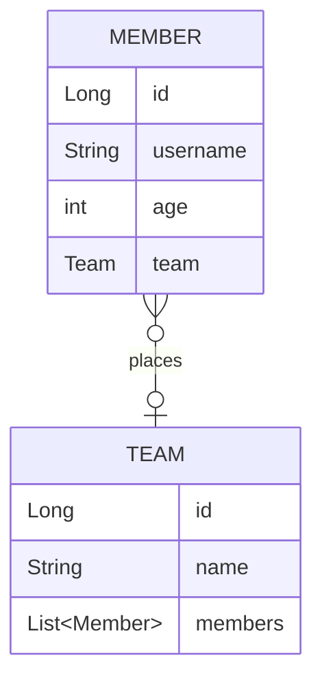

# 실전! 스프링 데이터 JPA

## 프로젝트 생성 및 세팅
- 'https://start.spring.io/' 에서 프로젝트 생성
    - SpringBoot `2.7.13`
    - Gradle Groovy `7.6.1`
    - java `17`
    - Dependencies
        - WEB : `Spring Web`
        - SQL : `Spring Data JPA`  `H2 Database`
        - DEVELOPER TOOLS : `Lombok`
        - External Library : `com.github.gavlyukovskiy:p6spy-spring-boot-starter:1.5.7`
- IDE : IntelliJ
- DB : H2 `jdbc:h2:tcp://localhost/~/querydsl`

## Querydsl 설정
```java
//build.gradle
buildscript {
    ext {
        queryDslVersion = "5.0.0"   
    }
}

plugins {
    ...
    id "com.ewerk.gradle.plugins.querydsl" version "1.0.10"
    ...
}
dependencies{
    ...
    implementation"com.querydsl:querydsl-jpa:${queryDslVersion}"
    annotationProcessor"com.querydsl:querydsl-apt:${queryDslVersion}"
    ...
}

def querydslDir = "$buildDir/generated/querydsl"
querydsl {
    jpa = true
    querydslSourcesDir = querydslDir
}
sourceSets {
    main.java.srcDir querydslDir
}
configurations {
    querydsl.extendsFrom compileClasspath
}
compileQuerydsl{
    options.annotationProcessorPath=configurations.querydsl
}
```
- Gradle IntelliJ 사용법
> Gradle -> Tasks -> build -> clean  
> Gradle -> Tasks -> other -> compileQuerydsl
- Q타입 생성 확인
> build -> generated -> querydsl

## 빌드하기
```bash
# 빌드
$ .\gradlew build

# 실행
$ cd .\build\libs 
$ java -jar .\querydsl-0.0.1-SNAPSHOT.jar
```
---

### 💜 도메인 설계
